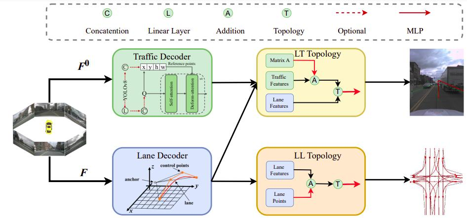

<div align="center">
<h1>
<b>
TopoMLP: An Simple yet Strong Pipeline for Driving Topology Reasoning</b>
</h1>
</div>

<p align="center"></p>

> **[TopoMLP: An Simple yet Strong Pipeline for Driving Topology Reasoning](https://arxiv.org/abs/2310.06753)**
>
> Dongming Wu, Jiahao Chang, Fan Jia, Yingfei Liu, Tiancai Wang, Jianbing Shen

## TL;DR
TopoMLP is **the 1st solution for 1st OpenLane Topology** in Autonomous Driving Challenge.
It suggests a “first-detect-then-reason” philosophy for
better topology prediction. 
It includes two well-designed high-performance detectors and two elegant MLP networks with position
embedding for topology reasoning.


- For lane detection, we represent each centerline as a smooth
Bezier curve.
- For traffic detection, we propose to optionally improve the query-based
detectors by elegantly incorporating an extra object detector YOLOv8.
- For lane-lane and lane-traffic topology prediction, MLPs is enough for better performance.

## News

- [2023.10.11] Our paper is released at [arXiv](https://arxiv.org/abs/2310.06753).


## Setup

For dataset preparation and environment requirements, please refer to [OpenLane-V2](https://github.com/OpenDriveLab/OpenLane-V2/blob/master/docs/getting_started.md#download-data).

## Training and Evaluation

### Training
If you want to train the model, please run the following command:
```shell
./tools/dist_train.sh ${CONFIG_FILE} ${GPU_NUM} [optional arguments]
```
For example, if you want to train TopoMLP on OpenLane-V2 subset-A train set, please run the following command:
```shell
./tools/dist_train.sh projects/configs/topomlp/topomlp_setA_r50_wo_yolov8.py 8 --work-dir=./work_dirs/topomlp_setA_r50_wo_yolov8
```
The training on 8 Nvidia A100 GPUs takes about 15 hours.

### Evaluation

If you want to evaluate the model, please run the following command:
```shell
./tools/dist_test.sh ${CONFIG_FILE} ${CHECKPOINT_FILE} ${GPU_NUM} --eval=bbox
```


## Main Results

The results on **[Openlane-V2](https://github.com/OpenDriveLab/OpenLane-V2) subset-A val** set:

|    Method    |  Backbone | Epoch | DET<sub>l</sub> | TOP<sub>ll</sub> | DET<sub>t</sub> | TOP<sub>lt</sub> | OLS  | Config/Weight/Log |
|:------------:|:---------:|:-----:|:---------------:|:----------------:|:---------------:|:----------------:|:----:|:-----------------:|
|     STSU     | ResNet-50 |  24   |      12.7       |       0.5        |      43.0       |       15.1       | 25.4 |         -         |
| VectorMapNet | ResNet-50 |  24   |      11.1       |       0.4        |      41.7       |       6.2        | 20.8 |         -         |
|    MapTR     | ResNet-50 |  24   |      17.7       |       1.1        |      43.5       |       10.4       | 26.0 |         -         |
|   TopoNet    | ResNet-50 |  24   |      28.5       |       4.1        |      48.1       |       20.8       | 35.6 |         -         |
|   TopoMLP    | ResNet-50 |  24   |      28.3       |       7.2        |      50.0       |       22.8       | 38.2 ||
|   TopoMLP*   | ResNet-50 |  24   |      28.8       |       7.8        |      53.3       |       30.1       | 41.2 ||
> $*$ means using YOLOv8 proposals.
> 
> 

The results on **[Openlane-V2](https://github.com/OpenDriveLab/OpenLane-V2) subset-B val** set:

|    Method    |  Backbone | Epoch | DET<sub>l</sub> | TOP<sub>ll</sub> | DET<sub>t</sub> | TOP<sub>lt</sub> | OLS  | Config/Weight/Log |
|:------------:|:---------:|:-----:|:---------------:|:----------------:|:---------------:|:----------------:|:----:|:-----------------:|
|     STSU     | ResNet-50 |  24   |       8.2       |       0.0        |      43.9       |       9.4        | 21.2 |         -         |
| VectorMapNet | ResNet-50 |  24   |       3.5       |       0.0        |      49.1       |       1.4        | 16.3 |         -         |
|    MapTR     | ResNet-50 |  24   |      15.2       |       0.5        |      54.0       |       6.1        | 25.2 |         -         |
|   TopoNet    | ResNet-50 |  24   |      24.3       |       2.5        |      55.0       |       14.2       | 33.2 |         -         |
|   TopoMLP    | ResNet-50 |  24   |      26.6       |       7.6        |      58.3       |       17.8       | 38.7 |                   |

## Citation
If you find our work useful in your research, please consider citing it.

```
@article{wu2023topomlp,
  title={TopoMLP: An Simple yet Strong Pipeline for Driving Topology Reasoning},
  author={Wu, Dongming and Chang, Jiahao and Jia, Fan and Liu, Yingfei and Wang, Tiancai and Shen, Jianbing},
  journal={arXiv preprint},
  year={2023}
}
```


## Acknowledgements
We thank the authors that open the following projects. 
- [MMDetection3d](https://github.com/open-mmlab/mmdetection3d)
- [PETRv2](https://github.com/megvii-research/PETR)
- [MOTRv2](https://github.com/megvii-research/MOTRv2)
- [OpenLane-v2](https://github.com/OpenDriveLab/OpenLane-V2)
- [TopoNet](https://github.com/OpenDriveLab/TopoNet)


